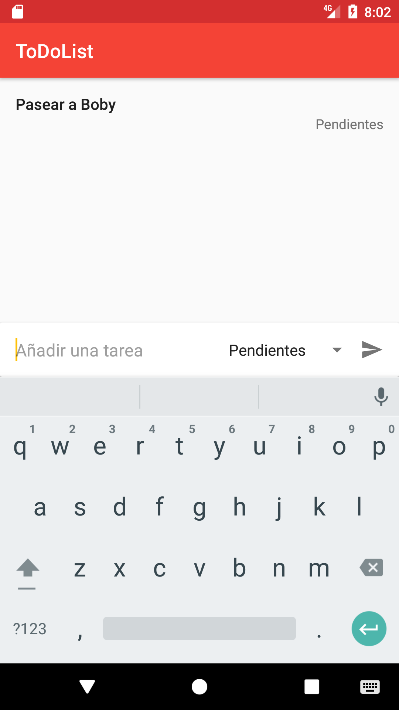

#HSLIDE

**Kevin Salazar Llashag**

[https://github.com/kevicsalazar](https://github.com/kevicsalazar)

#HSLIDE

###Kotlin vs Java

**With Kotlin, you can do more with less code**

#HSLIDE

[**ToDoList-App**](https://github.com/kevicsalazar/ToDoList-Kotlin)



#HSLIDE

**Collections**

```
List<Item> items = new ArrayList<>();
items.add(new Item(id, task, category))
//...
```

```
List<Item> filteredItems = new ArrayList<>();
for (Item item : items) {
    if (item.getCategory().equals("Pendientes")) {
        if (filteredItems.size() <= 3) {
            filteredItems.add(item);
        } else {
            break;
        }
    }
}
```

#HSLIDE

**Collections**


```
val items = mutableListOf()
items.add(Item(id, task, category))
//...
```

```
val filteredItems = items.filter { it.category == "Pendientes" }.take(3)
```

```
items.forEach {  }
items.forEachIndexed { index, item ->  }
items.sortedBy {  }
//...
```

#HSLIDE

**For Loops**

```
for (int i = 1; i < 11 ; i++) { }
for (int i = 1; i < 11 ; i+=2) { }
for (String item : collection) { }
```

```
for (i in 1..10) { }
for (i in 1..10 step 2) {}
for (item in collection) {}
for ((index, item) in collection.withIndex()) {}
```

#HSLIDE

**Functions**

```
saveTask("Terminar la Tesis", "Importante")
saveTask("Pasear a Boby")
```

```
public void saveTask(String task, String category) {
    //...
}
public void saveTask(String task) {
    saveTask(task, "Pendientes")
}
```

#HSLIDE

**Functions**

```
saveTask("Terminar la Tesis", "Importante")
saveTask("Pasear a Boby")
```

```
fun saveTask(task: String, category: String = "Pendientes") {
    //...
}
```

#HSLIDE

**Is As In**

```
if(x instanceof Integer){ }
final String text = (String) other;
if(x >= 0 && x <= 10 ){}
```

```
if (x is Int) { }
val text = other as String
if (x in 0..10) { }
```

#HSLIDE

**Switch/When Expression**

```
final int x = // value;
final String xResult;

switch (x){
  case 0:
  case 11:
    xResult = "0 or 11";
    break;
  case 1:
  case 2:
    //...
  case 10:
    xResult = "from 1 to 10";
    break;
  default:
    if(x < 12 && x > 14) {
      xResult = "not from 12 to 14";
      break;
    }
    xResult = "otherwise";
}
```

#HSLIDE

**Switch/When Expression**

```
val x = // value
val xResult = when (x) {
  0, 11 -> "0 or 11"
  in 1..10 -> "from 1 to 10"
  !in 12..14 -> "not from 12 to 14"
  else -> "otherwise"
}
```

#HSLIDE

**Data Class**

```
public class Item {

    private String id;
    private String task;
    private String category;
    
    public Item(...) {
        ...
    }
    
    // getters, setters, toString()
}
```

```
data class Item(val id: String,
                val task: String,
                val category: String)
```

#HSLIDE

**Null Safety**

```
val item: Item? = null
...
item?.task = "Pasear a Boby"
```

```
val items = pref.any<List<Item>>("items")
items?.forEach { view.addItemToAdapter(it) }
```

#HSLIDE

**Extensions Functions**

Podemos extender la funcionalidad de las clases.

```
fun Context.hideKeyboard(view: View) {
    inputMethodManager.hideSoftInputFromWindow(view.windowToken, 0)
}

hideKeyboard(view)
```

#HSLIDE

**Preferences Extensions**

```
fun SharedPreferences.put(key: String, value: Any) {
    when (value) {
        ...
        is String     -> edit().putString(key, value).apply()
        is Date       -> edit().putLong(key, value.time).apply()
        is JsonObject -> edit().putString(key, value.toString()).apply()
        is JsonArray  -> edit().putString(key, value.toString()).apply()
        else          -> edit().putString(key, Gson().toJson(value)).apply()
    }
}
```

```
val items = mutableListOf()
...
pref.put("items", items)
```

#HSLIDE

**Android Extensions**

```
Button button = (Button) findViewById(R.id.button);
EditText editText = (EditText) findViewById(R.id.editText); 
button.setOnClickListener(new View.OnClickListener() {
    @Override
    public void onClick(View v) {
        presenter.saveTask(editText.getText().toString())
        editText.setText("");
    }
});
```

```
import kotlinx.android.synthetic.main.activity_main.*
```

```
button.setOnClickListener {
    presenter?.saveTask(editText.text.toString())
    hideKeyboard(editText)
    editText.setText("")
}
```

#HSLIDE

**Referencias**

* Kotlin Docs [https://kotlinlang.org/docs/reference/](https://kotlinlang.org/docs/reference/)
* Kotlin vs Java [https://yalantis.com/blog/kotlin-vs-java-syntax/](https://yalantis.com/blog/kotlin-vs-java-syntax/)
* Gson Extensions (Kotson) [https://github.com/SalomonBrys/Kotson](https://github.com/SalomonBrys/Kotson)
* Kotlin Extensions [https://github.com/kevicsalazar/UpLabs-Kotlin](https://github.com/kevicsalazar/UpLabs-Kotlin)
* From Java to Kotlin [https://fabiomsr.github.io/from-java-to-kotlin/](https://fabiomsr.github.io/from-java-to-kotlin/)
* UpLabs App [https://gitpitch.com/kevicsalazar/UpLabs-Kotlin](https://gitpitch.com/kevicsalazar/UpLabs-Kotlin)